# NOVA ATHLETICS — ERD

> Contract: mọi bảng/cột/khóa/FK/index dưới đây là **bất biến** cho PROMPT 2/3/4.

```mermaid
erDiagram
    users ||--o{ user_roles : has
    roles ||--o{ user_roles : assigned
    roles ||--o{ role_permissions : has
    permissions ||--o{ role_permissions : granted

    users ||--o| customers : extends
    users ||--o| employees : extends
    customers ||--o{ addresses : has
    customers ||--o{ carts : owns
    customers ||--o{ wishlists : owns
    customers ||--o{ orders : places
    customers ||--o{ reviews : writes
    customers ||--o{ recently_viewed : views
    customers ||--o{ notifications : receives

    products ||--o{ product_variants : has
    products ||--o{ product_images : has
    products ||--o{ product_attribute_values : has
    products ||--o{ product_categories : mapped
    products ||--o{ product_collections : mapped
    products ||--o{ product_tag_mapping : tagged
    categories ||--o{ product_categories : contains
    categories ||--o{ categories : parent
    collections ||--o{ product_collections : contains
    product_tags ||--o{ product_tag_mapping : maps
    product_attributes ||--o{ product_attribute_values : defines

    product_variants ||--o{ warehouse_inventory : stocked
    product_variants ||--o{ cart_items : in
    product_variants ||--o{ wishlist_items : in
    product_variants ||--o{ order_items : snapshot
    product_variants ||--o{ inventory_reservations : reserved
    product_variants ||--o{ inventory_transactions : logs

    warehouses ||--o{ warehouse_inventory : holds
    warehouses ||--o{ inventory_transfer_items : source_dest
    inventory_transfers ||--o{ inventory_transfer_items : has

    carts ||--o{ cart_items : has
    wishlists ||--o{ wishlist_items : has
    orders ||--o{ order_items : has
    orders ||--o| payments : paid_by
    orders ||--o{ shipments : shipped_via
    orders ||--o{ coupon_usages : applied
    coupons ||--o{ coupon_usages : used
    products ||--o{ reviews : reviewed

    users ||--o{ audit_logs : performed
    media ||--o{ product_images : stored

    %% standalone
    store_settings
    notifications
    audit_logs
    media
    inventory_transactions
```

---

## Entities (Mermaid source để render docs)

Full schema chi tiết: `docs/database.md`.

### Legend
- `users` là root cho `customers` (customer) và `employees` (internal).
- `product_variants` là SKU — inventory gắn vào `(variant, warehouse)`, không gắn vào `products`.
- `order_items` snapshot tên/SKU/variant/price tại thời điểm đặt — không JOIN live product.
- `inventory_reservations` TTL 15m, cron release expired.
- `inventory_transfers` + `inventory_transfer_items` cho chuyển kho.

---

## Module → Tables mapping

| Module | Tables |
|--------|--------|
| auth/user | users, roles, permissions, user_roles, role_permissions |
| customer | customers, addresses, recently_viewed |
| employee | employees |
| product | products, product_variants, product_images, product_attributes, product_attribute_values, product_tags, product_tag_mapping |
| category | categories, product_categories |
| collection | collections, product_collections |
| warehouse | warehouses |
| inventory | warehouse_inventory, inventory_transactions, inventory_reservations, inventory_transfers, inventory_transfer_items |
| cart | carts, cart_items |
| wishlist | wishlists, wishlist_items |
| order | orders, order_items, shipments |
| payment | payments |
| promotion | coupons, coupon_usages |
| review | reviews |
| notification | notifications |
| media | media |
| audit | audit_logs |
| system | store_settings, idempotency_keys |

---

## Notes

- Soft delete chỉ cho: `products`, `product_variants`, `categories`, `collections`, `customers` (GDPR anonymize), `warehouses` (deactivate). Các bảng transactional (orders, payments, inventory_transactions, audit_logs) **không** soft delete.
- `product_images.sort_order` quyết định ảnh chính (`sort_order = 0`).
- `warehouse_inventory` PK = `(variant_id, warehouse_id)`.
- Tất cả bảng có `id BIGSERIAL PK`, `created_at`, `updated_at` (trừ append-only logs chỉ có `created_at`).
